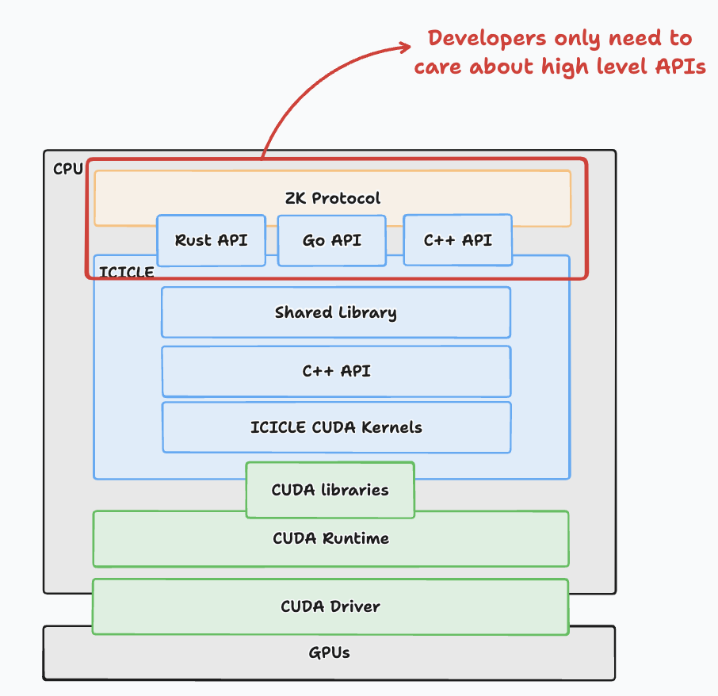

# Integrations

ICICLE has been used by companies like [Celer Network](https://github.com/celer-network), [Gnark](https://github.com/Consensys/gnark), [EZKL](https://blog.ezkl.xyz/post/acceleration/) and others to accelerate their ZK proving pipeline.

Many of these integrations have been a collaboration between Ingonyama and the integrating company. We have learned a lot about designing GPU based ZK provers.  

If you're interested in understanding these integrations better or learning how you can use ICICLE to accelerate your existing ZK proving pipeline this is the place for you.

## A primer to building your own integrations

Lets illustrate an ICICLE integration, so you can understand the core API and design overview of ICICLE.



Engineers usually use a cryptography library to implement their ZK protocols. These libraries implement efficient primitives which are used as building blocks for the protocol; ICICLE is such a library. The difference is that ICICLE is designed from the start to run on GPUs; the Rust and Golang APIs abstract away all low level CUDA details. Our goal was to allow developers with no GPU experience to quickly get started with ICICLE. 

A developer may use ICICLE with two main approaches in mind.

1. Drop in replacement approach.
2. Full GPU replacement approach.

The first approach for GPU-accelerating your Prover with ICICLE is quick to implement, but it has limitations, such as reduced memory optimization and limited protocol tuning for GPUs. It's a solid starting point, but those committed to fully leveraging GPU acceleration should consider a more comprehensive approach.

A full GPU replacement means preforming the entire ZK proof on the GPU. This approach will reduce latency to a minimum and requires you to change the way you implement the protocol to be more GPU friendly. This approach will take full advantage of GPU acceleration. Redesigning your prover this way may take more engineering effort but we promise you that its worth it!

## Using ICICLE integrations

Here we cover how a developer can run his existing circuits on ICICLE integrated provers.

### Gnark

[Gnark](https://github.com/Consensys/gnark) officially supports GPU proving with ICICLE. Currently only Groth16 on curve `BN254` is supported. This means that if you are currently using Gnark to write your circuits you can enjoy GPU acceleration without making many changes.

To use GPUs, add the icicle buildtag to your build/run commands, e.g. `go run -tags=icicle main.go.`

You must also switch to the ICICLE backend, WithIcicleAcceleration backend ProverOption:

```
// toggle on
proofIci, err := groth16.Prove(ccs, pk, secretWitness, backend.WithIcicleAcceleration())
    
// toggle off
proof, err := groth16.Prove(ccs, pk, secretWitness)
```

You can reference the [Gnark docs](https://github.com/Consensys/gnark?tab=readme-ov-file#gpu-support) for further information.


### Halo2

EZKL [Halo2](https://github.com/zkonduit/halo2) fork integrated with ICICLE for GPU acceleration. This means that you can run your existing Halo2 circuits with GPU acceleration just by activating a feature flag.

To enable GPU acceleration just enable `icicle_gpu` [feature flag](https://github.com/zkonduit/halo2/blob/3d7b5e61b3052680ccb279e05bdcc21dd8a8fedf/halo2_proofs/Cargo.toml#L102).

This feature flag will seamlessly toggle on GPU acceleration for you. You can have a look at [EZKL](https://github.com/zkonduit/ezkl) to see how their team utilized GPU acceleration.
