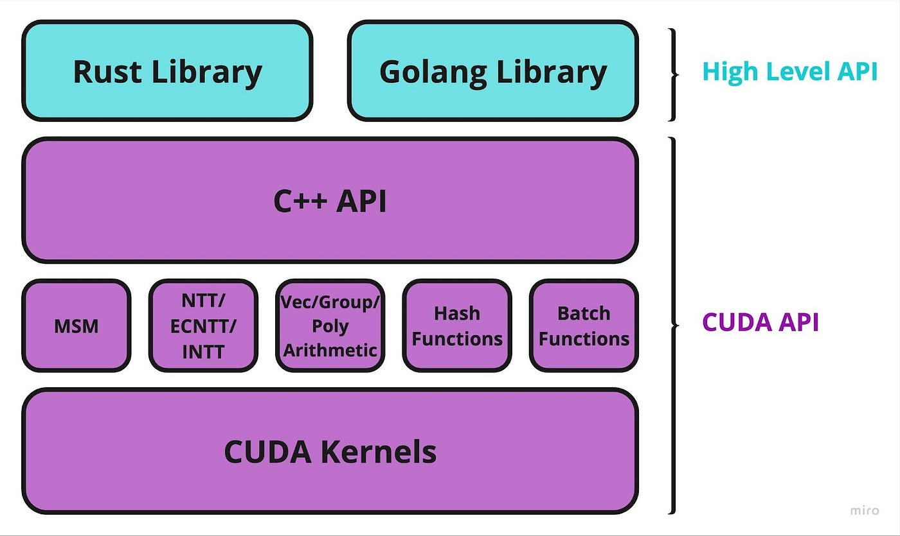

# Getting started with ICICLE

This guide is oriented towards developers who want to start writing code with the ICICLE libraries. If you just want to run your existing ZK circuits on GPU refer to TODO[this guide](https://github.com/ingonyama-zk/icicle/tree/main/icicle) please.

## ICICLE repository overview



The diagram above displays the general architecture of ICICLE and the API layers that exists. The CUDA API which we also call ICICLE Core is the lowest level and is comprised of CUDA kernels which implement all primitives such as MSM for example as well as C++ wrappers which expose these methods for different curves.

ICICLE Core compiled into a shared library this library can be used with our official Golang and Rust wrappers or you can implement a wrapper for it in any language of your desire.

Based on this dependency architecture the ICICLE repository has three main sections, each section is independent from the other.

- ICICLE core
- ICICLE Rust bindings
- ICICLE Golang bindings

### ICICLE Core

[ICICLE core](https://github.com/ingonyama-zk/icicle/tree/main/icicle) contains all the low level CUDA code implementing primitives such as [points](https://github.com/ingonyama-zk/icicle/tree/main/icicle/primitives) and [MSM](https://github.com/ingonyama-zk/icicle/tree/main/icicle/appUtils/msm). There also exists higher level C++ wrappers to expose the low level CUDA primitives ([example](https://github.com/ingonyama-zk/icicle/blob/main/icicle/curves/bn254/msm.cu)).

ICICLE Core would typically be compiled into a shared library and used in a third party language such as Rust, Golang or Python.

### ICICLE Rust and Golang bindings

- [ICICLE Rust bindings](https://github.com/ingonyama-zk/icicle/tree/main/wrappers/rust)
- [ICICLE Golang bindings](https://github.com/ingonyama-zk/icicle/tree/main/goicicle) 

These bindings allow you you to easily use ICICLE in a Rust or Golang project. Setting up Golang bindings requires a bit of extra steps compared to the Rust bindings which utilize the `cargo build` tool.


## Running ICICLE

This guide assumes that you have a Linux or Windows machine with a Nvidia GPU installed. If you don't have access to a Nvidia GPU you can access one for free on [Google Colab](https://colab.google/).

### Prerequisites

- NVCC (version 12.0 or newer)
- cmake 3.18 and above
- GCC - version 9 or newer is recommended.
- Any Nvidia GPU
- Linux or Windows operating system.


If you don't wish to install these prerequisites you can follow this tutorial from within our [ZK-Container](https://github.com/ingonyama-zk/icicle/blob/main/Dockerfile) (docker container). To learn more about using ZK-Containers read this.

### Setting up ICICLE and running tests

The objective of this guide is to make sure you can run the ICICLE Core, Rust and Golang tests, achieving this will make sure you know how to setup ICICLE and run a ICICLE program. For the sake of simplicity we will be using the ICICLE docker container as our environment, of course you may install the prerequisites on your machine and follow the same commands in your terminal.


#### Setting up our environment

Lets begin by cloning the ICICLE repository:

```
git clone https://github.com/ingonyama-zk/icicle
```

We wil proceed to build the docker image [found here](https://github.com/ingonyama-zk/icicle/blob/main/Dockerfile):

```
docker build -t icicle-demo .
docker run -it --runtime=nvidia --gpus all --name icicle_container icicle-demo
```

- `-it` runs the container in interactive mode with a terminal. 
- `--gpus all` Allocate all available GPUs to the container. You can also specify which GPUs to use if you don't want to allocate all.
- `--runtime=nvidia` Use the NVIDIA runtime, necessary for GPU support.

To read more about these settings reference this [article](https://developer.nvidia.com/nvidia-container-runtime).

If you accidentally close your terminal and want to reconnect just call:

```
docker exec -it icicle_container bash
```

Lets make sure that we have the correct CUDA version before proceeding

```
nvcc --version
```

You should see something like this

```
nvcc: NVIDIA (R) Cuda compiler driver
Copyright (c) 2005-2023 NVIDIA Corporation
Built on Tue_Aug_15_22:02:13_PDT_2023
Cuda compilation tools, release 12.2, V12.2.140
Build cuda_12.2.r12.2/compiler.33191640_0
```

Make sure the release version is at least 12.0.

#### ICICLE Core

ICICLE Core is found under [`/icicle`](https://github.com/ingonyama-zk/icicle/tree/main/icicle). To build and run its test first:

```
cd icicle
```

We are going to compile ICICLE for a specific curve

```
mkdir -p build
cmake -S . -B build -DCURVE=bn254 -DBUILD_TESTS=ON
cmake --build build
```

`-DBUILD_TESTS=ON` compiles the tests as well, without this flag `ctest` wont work.
`-DCURVE=bn254` tells the compiler which curve to build. You can find a list of supported curves [here](https://github.com/ingonyama-zk/icicle/tree/main/icicle/curves).

The output in `build` folder should include the shared libraries for the compiled curve.

To run the test 

```
cd build
ctest
```

#### ICICLE Rust

The rust bindings work by first compiling the CUDA shared libraries as seen [here](https://github.com/ingonyama-zk/icicle/blob/main/wrappers/rust/icicle-curves/icicle-bn254/build.rs). The compilation of CUDA and the Rust library is all handled by the rust build toolchain.

Similar to ICICLE Core here we also have to compile per curve.

Lets compile curve `bn254`

```
cd wrappers/rust/icicle-curves/icicle-bn254
```

Now lets build our library

```
cargo build --release
```

This may take a couple minutes since we are compiling both the CUDA and Rust code.

To run test

```
cargo test -- --test-threads=1
```

`--test-threads=1` is needed because currently some tests might interfere with one another inside the GPU.

We also include some benchmarks

```
cargo bench
```

#### ICICLE Golang

The Golang bindings are a bit more of a manual process. We start by compiling a shared library for a curve we want to use in this case `bn254`.

```
cd goicicle
```

Now lets build our shared library

```
make libbn254.so
```

The current supported options are `libbn254.so`, `libbls12_381.so`, `libbls12_377.so`, `libbw6_671.so` and `all` to compile all curves. The resulting `.so` files are the compiled shared libraries for each curve.

`make clean` will remove compiled shared libraries.

Before using the shared libraries we need to make our OS aware of them

```
export LD_LIBRARY_PATH=$LD_LIBRARY_PATH/<path_to_shared_libs>
```

> :warning: **Warning**: On some systems, despite exporting `LD_LIBRARY_PATH`, the system still won't be able to locate our shared libraries. In this case, try the following steps.
>
> ```
> export CGO_LDFLAGS="-L/<path_to_shared_lib>/"
> ```

To run test for a specific curve

```
go test ./goicicle/curves/bn254 -count=1
```

## Using ICICLE in your project

Using ICICLE Core in your project may be abit challenging as you may need to write wrappers and abstractions to make it easier to call the ICICLE methods. We offer developers two binding libraries:

- Golang bindings
- Rust bindings

Using these bindings you can easily use ICICLE in your projects.

## Writing new bindings for ICICLE

Since ICICLE Core is written in CUDA / C++ its really simple to generate shared libraries. These shared libraries can be installed on any system and called by higher level languages such as Golang or Python.

Shared libraries can be loaded into memory once and used by multiple programs, reducing memory usage and potentially improving performance. They also allow you to separate functionality into distinct modules so your shared library may need to compile only specific features that you want to use.

Lets review the Golang bindings since its a pretty verbose example (compared to rust which hides it pretty well) of using shared libraries. Golang has a library named `CGO` which can be used to link shared libraries. Here's a basic example on how you can use cgo to link these libraries:


```go
/*
#cgo LDFLAGS: -L/path/to/shared/libs -lbn254 -lbls12_381 -lbls12_377 -lbw6_671
#include "icicle.h" // make sure you use the correct header file(s)
*/
import "C"

func main() {
    // Now you can call the C functions from the ICICLE libraries.
    // Note that C function calls are prefixed with 'C.' in Go code.

    out := (*C.BN254_projective_t)(unsafe.Pointer(p))
	in := (*C.BN254_affine_t)(unsafe.Pointer(affine))

	C.projective_from_affine_bn254(out, in)
}
```

The comments on the first line tell `CGO` which libraries to import as well as which header files to include. You can then call methods which are part of the shared library and defined in the header file, `C.projective_from_affine_bn254` is an example.

If you wish to create your own bindings for a language of your choice we suggest you start by investigating how you can call shared libraries.

### ICICLE Adapters

One of the core ideas behind ICICLE is the idea that developers can gradually accelerate their provers. Many protocols are written using other cryptographic libraries and completely replacing them may be complex and time consuming.

There for we offer adapters for various popular libraries, these adapters allow us to convert points and scalars between different formats defined by various libraries. Here is a list:

Golang adapters:
- [Gnark crypto adapter](https://github.com/ingonyama-zk/iciclegnark)
