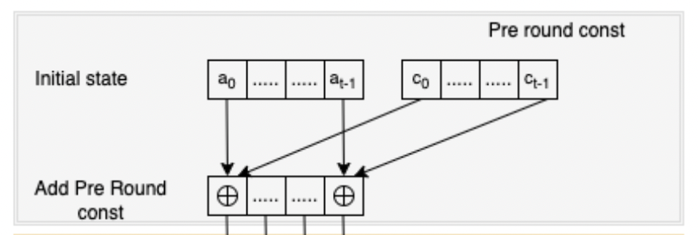
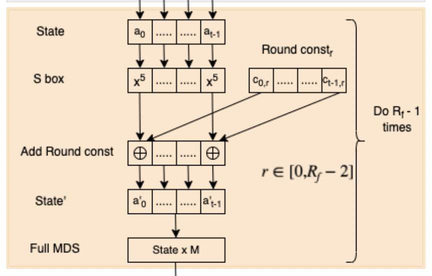
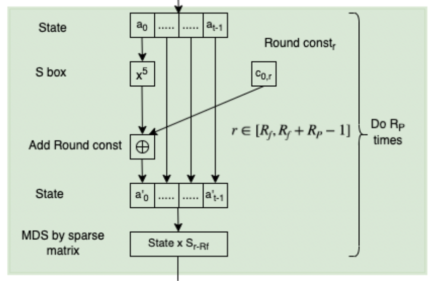

# Poseidon

Poseidon hash is a popular hash in the ZK ecosystem primarily because its optimized to work over large prime fields, a common setting for ZK proofs, thereby minimizing the number of multiplicative operations required.

Poseidon hash has been used in many popular ZK protocols such as Filecoin and [Plonk](https://drive.google.com/file/d/1bZZvKMQHaZGA4L9eZhupQLyGINkkFG_b/view?usp=drive_open).

Our implementation of [Poseidon hash](https://eprint.iacr.org/2019/458.pdf) is implemented  in accordance with the optimized [Filecoin version](https://spec.filecoin.io/algorithms/crypto/poseidon/).

Let understand how Poseidon hash works.

### Initialization

Poseidon starts with the initialization of its internal state, which is composed of the input elements and some pregenerated constants. An initial round constant is added to each element of the internal state. This is part of the initialization to ensure the state is properly mixed from the outset.

This is done to prevent collions and to prevent certain cryptographic attacks by insuring that the internal state is sufficiently mixed and unpredictable,



### Applying full and partial rounds

To generate a secure hash output the algorithm goes through a series of "full round" and "partial rounds" as well as transformations between these sets of rounds.

First full rounds => apply SBox and Round constants => partial rounds => Last full rounds => Apply SBox

#### Full rounds



**Uniform Application of S-Box:** In full rounds, the S-box (a non-linear transformation) is applied uniformly to every element of the hash function's internal state. This ensures a high degree of mixing and diffusion, contributing to the hash function's security. The S-box involves raising each element of the state to a certain power denoted by `α` is a member of the finite field defined by the prime `p`, `α` can be selected by the user.

**Linear Transformation:** After applying the S-box, a linear transformation is performed on the state. This involves multiplying the state by a MDS (Maximum Distance Separable) Matrix. which further diffuses the transformations applied by the S-box across the entire state.

**Addition of Round Constants:** Each element of the state is then modified by adding a unique round constant. These constants are different for each round and are precomputed as part of the hash function's initialization. The addition of round constants ensures that even minor changes to the input produce significant differences in the output.

#### Partial Rounds

**Selective Application of S-Box:** Partial rounds apply the S-box transformation to only one element of the internal state per round, rather than to all elements. This selective application significantly reduces the computational complexity of the hash function without compromising its security. The choice of which element to apply the S-box to can follow a specific pattern or be fixed, depending on the design of the hash function.

**Linear Transformation and Round Constants:** A linear transformation is performed, and round constants are added. However, the linear transformation in partial rounds can be designed to be less computationally intensive (this is done by using a sparse matrix) than in full rounds, further optimizing the function's efficiency.


The user of a Poseidon hash often can choose how many partial or full rounds he wishes to apply, more full rounds will increase security and degrade performance. The choice and balance depend highly on the use case.



## Using Poseidon Hash

ICICLE Poseidon hash is implemented for GPU and parallelization is preformed for each element of the state rather than for each state.

### Supported API

[`Rust`](https://github.com/ingonyama-zk/icicle/tree/main/wrappers/rust/icicle-core/src/poseidon), [`C++`](https://github.com/ingonyama-zk/icicle/tree/main/icicle/appUtils/poseidon)

### Supported curves

Poseidon supports the following curves:

`bls12-377`, `bls12-381`, `bn-254`, `bw6-761`

### Constants

Poseidon is extremely customizable using different constants will producing different hashes, different security levels and different performance results.

We support pre calculated and optimized constants for each of the [supported curves](#supported-curves).The constants can be found [here](https://github.com/ingonyama-zk/icicle/tree/main/icicle/appUtils/poseidon/constants), the are labeled clearly per curve `<curve_name>_poseidon.h`.

If you wish to generate your own constants you can use our python script which can be found [here](https://github.com/ingonyama-zk/icicle/blob/b6dded89cdef18348a5d4e2748b71ce4211c63ad/icicle/appUtils/poseidon/constants/generate_parameters.py#L1).

Prerequisites:
- Install python 3
- `pip install poseidon-hash`
- `pip install galois`
- `pip install numpy`

You will then need to modify the following values before running the script.

```python
# Modify these
arity = 11 # we support arity arity > 0, but tested primarily with the most common ones 2, 4, 8 and 11.
p = 0x73EDA753299D7D483339D80809A1D80553BDA402FFFE5BFEFFFFFFFF00000001 # bls12-381
# p = 0x12ab655e9a2ca55660b44d1e5c37b00159aa76fed00000010a11800000000001 # bls12-377
# p = 0x30644e72e131a029b85045b68181585d2833e84879b9709143e1f593f0000001 # bn254
# p = 0x1ae3a4617c510eac63b05c06ca1493b1a22d9f300f5138f1ef3622fba094800170b5d44300000008508c00000000001 # bw6-761
prime_bit_len = 255
field_bytes = 32

...

# primitive_element = None
primitive_element = 7 # bls12-381
# primitive_element = 22 # bls12-377
# primitive_element = 5 # bn254
# primitive_element = 15 # bw6-761
```

We only support `alpha = 5` so if you want to use another alpha for SBox please reach out on discord or open a github issue.


## The Tree Builder

### Benchmarks 

We ran the Poseidon hash tree builder on:

**CPU**: 12th Gen Intel(R) Core(TM) i9-12900K/

**GPU**: RTX 3090 Ti

**Tree height**: 30 (2^29 elements)

The benchmarks include copying data from and to the device.


| Rows to keep parameter      | Run time, Icicle | Supranational PC2
| ----------- | ----------- | ----------- |  
| 10          | 8.3 seconds       |    13.6 seconds
| 20          | 8.2 seconds       |    13.6 seconds
| 29          | 12.2 seconds       |    13.6 seconds
