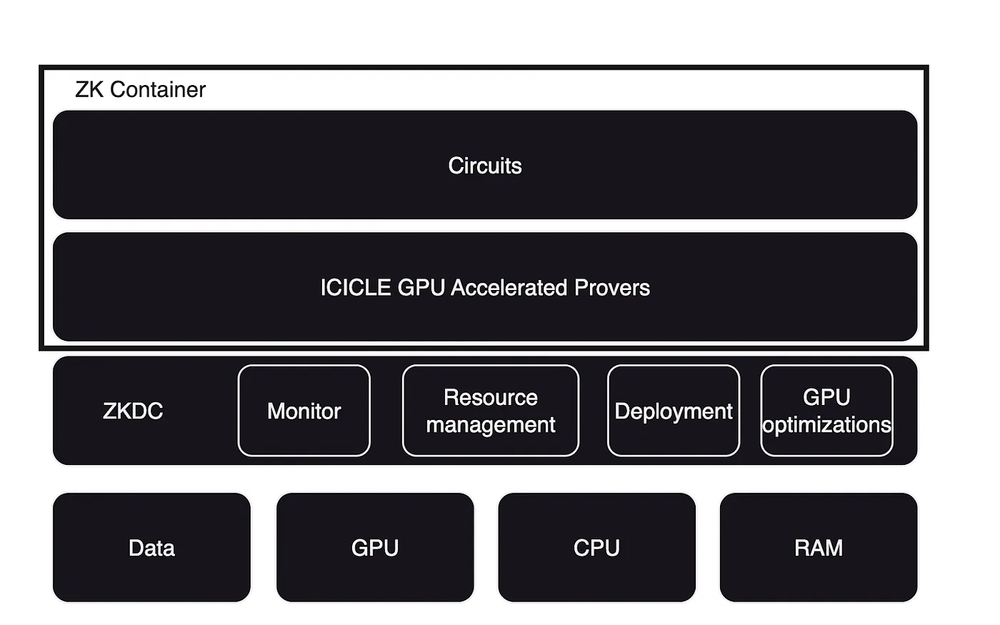

# ZK Containers

We found that developing ZK provers with ICICLE gives developers the ability to scale ZK provers across many machines and many GPUs. To make this possible we developed the ZK Container.

A ZK Container is an standardized, optimized and secure docker container that we configured with ICICLE applications in mind. A developer using ZK Containers can deploy his ICICLE application on a single machine or on a thousand GPU machines in a data center with minimal concerns regarding compatibility.

ZK Containers have been used by Ingonyama clients to achieve scalability across large data centers.
We suggest you read our [article](https://medium.com/@ingonyama/product-announcement-zk-containers-0e2a1f2d0a2b) regarding ZK Containers to understand the benefits of using them.

